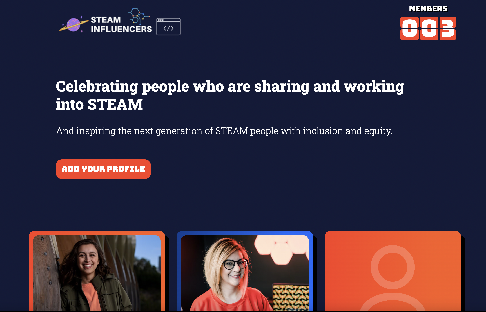

# STEAM Influencers
## Celebrating people who are sharing and working into STEAM.



## Add your profile to the site

Do you work into STEAM and share content? You should feature on STEAM influencers!

1. Fork the repository to your GitHub account and clone it to your local machine.

2. Navigate to `src/_data/profiles` and create a new `[yourIdentifier].json` file.

3. Add your details and **REMEMBER TO REMOVE ALL COMMENTS FROM YOUR JSON FILE! (e.g. // optional)**

```json
// src/_data/profiles/[yourIdentifier].json

{
  "name": "Your name", // required
  "jobTitle": "Your job title", // required
  "company": "Your company", // optional
  "bio": "A short bio, around the length of a Twitter bio.", // required
  "githubUsername": "yourGitHubUsername", // optional
  "twitterUsername": "yourTwitterUsername", // optional
  "twitchUsername": "yourTwitchUsername", // optional
  "instagramUsername": "yourTwitchUsername", // optional
  "tiktokUsername": "yourTwitchUsername", // optional
  "website": "https://yourwebsite.com/" // optional
}
```

4. Navigate to `src/_data/images` and add a

- **SQUARE**
- high quality JPEG image
- named `[yourIdentifier.jpeg]`.
- Please note the `.jpeg` extension and NOT `.jpg`.
- The Eleventy image plugin will automatically convert and optimise your image for different browsers, screen sizes and
  DPR.

5. Commit and push your changes, and open up a PR!

---

STEAM Influencers is built with [Eleventy](https://www.11ty.dev/docs/).

